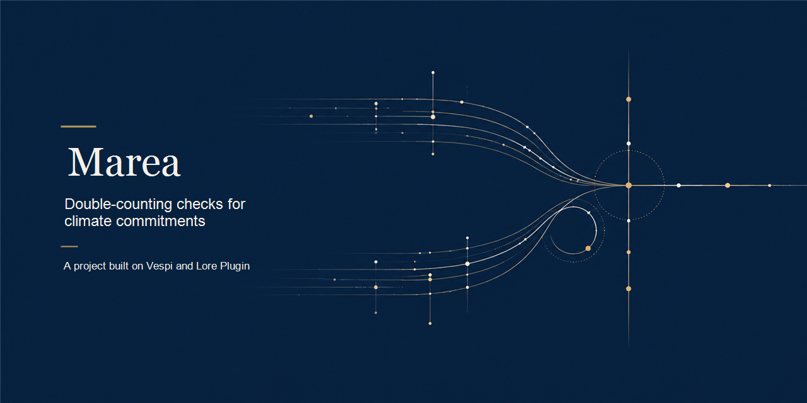

[](./assets/cover.png)

# Marea

<p align="center">
  <a href="#english"></a>
  <a href="./LICENSE"></a>
  <a href="./docs/EVIDENCE.md"></a>
  <a href="./docs/HOW_IT_WORKS.md"></a>
  <a href="https://github.com/andresanemic/vespi"></a>
  <a href="https://github.com/andresanemic/vespi/tree/ed559e83c976dd6e6a379a5510db776206f670b4"></a>
</p>

<p align="center">Read in <a href="#english">English</a> or <a href="#espanol">español</a>.</p>

<p align="center">Marea is a local, documented prototype for making one narrow accounting collision visible: the same fictional activity-year pair declared twice.</p>

<p align="center">This public repository contains the agreement, documentation and recorded evidence. Source code is not included; the publication and review conditions are in <a href="./CODE_NOT_INCLUDED.md">Code not included</a> and <a href="./LICENSE">LICENSE</a>.</p>

---

<details>
<summary><b>Read in English</b></summary>

<a id="english"></a>

**Marea makes a duplicate climate-accounting entry visible and keeps its reason beside the first entry in the same local record.**

> **The unit is the activity-year pair: one fact can be recognized once.**

## The problem

When two countries recognize the same reduction, a combined total can count one claimed result twice. The arithmetic in each separate record may be correct while the accounting across both is not; unless someone links each declaration back to its origin activity and year, the collision can remain hidden.

Marea explores one small response to that problem. It records fictional declarations against a local origin and checks whether the activity-year pair already appears in the same metric track. A rejection carries the collision and a way to resolve it in the record itself. Marea does not calculate emissions or decide whether a real reduction happened.

## If you are judging Find Your Way or Meridian, start here

- Read the project foundation and its walkthrough. Start with [How it works](./docs/HOW_IT_WORKS.md).
- Open the test record. See [Evidence](./docs/EVIDENCE.md).
- Read the legal and verification limits. See [Legal and limits](./docs/LEGAL_AND_LIMITS.md).
- Review the publication conditions. See [Code not included](./CODE_NOT_INCLUDED.md) and the [review-only license](./LICENSE).

## In one minute

Imagine a local ledger with fictional entries. A person records Alba's origin activity and grants Alba authority with a metric, destination, ceiling and expiry. Alba declares that activity for 2027, with a named methodology, and the checker accepts it. Bruma then submits the same activity for the same year and metric. Marea rejects that second entry, names Alba's earlier declaration, and stores the rejection beside the acceptance. A reader can inspect the report or audit either entry without relying on the executor's summary.

## What it looks like in practice

The following excerpt comes from the recorded walkthrough. Every country, activity, methodology, unit and amount in it is fictional; the transcript is evidence of the documented local run, not a real-world accounting result.

```text
── 3. Alba declara una reducción con su metodología y su unidad: entra
  estado:   aceptada
  motivo:   reconocida en la pista tCO2e (guía 2/CMA.3, §8) bajo la autorización aut-alba-ghg
  ajuste:   lado suma, pista tCO2e (guía 2/CMA.3 §8), años 2027, anclas anc-alba-1
  recibo:   verified · cobertura anclaje-resuelve, metodologia-declarada, sin-doble-conteo, ajuste-en-pista, autorizacion-vigente
  anclaje:  pending en stellar:testnet — nada llegó a una red; esto NO está verificado afuera

── 4. Bruma declara reutilizando la misma unidad sobre el mismo hecho: se rechaza
  estado:   rechazada (unidad-compartida)
  motivo:   doble conteo por unidad compartida: alba ya reconoció anc-alba-1 (bosque de la cuenca alta) en 2027 con la declaración dec-alba-1, y bruma la declara otra vez en la misma métrica tCO2e y el mismo año: el mismo hecho no se reconoce dos veces
  evidencia: {"choques":[["anc-alba-1",2027]],"limpio":[],"contra":["dec-alba-1"],"pista":"tCO2e"}
  salida:   retira la declaración de bruma sobre anc-alba-1, o cambia de actividad: una reducción no puede estar en dos balances a la vez
  sello:    21eeacc59ed82a8c…
```

The run also records a control: two distinct activities in the same metric and year can both enter, and entries in distinct metric tracks can both enter in the same year. That is why the collision key is the activity-year pair rather than the year alone. The full transcript and fresh-session evidence are described in [Evidence](./docs/EVIDENCE.md).

## How Marea works

A person supplies the local origin and bounded authorization; a declaring country submits its entry; Marea checks the stored inputs; and a reader can independently inspect the same record.

```text
PERSON RECORDS ORIGIN ── PERSON GRANTS BOUNDED AUTHORITY
             │                              │
             └────────── COUNTRY DECLARES ──┘
                              │
                              ▼
        resolve origin · metric · method · year · amount · authority
                       ┌──────┴──────┐
                       ▼             ▼
                   accepted      rejected + reason
                       └──────┬──────┘
                              ▼
              one local register + sealed receipt
                              │
                              ▼
             independent recomputation + readable report
```

| Actor | What they can do | What the record shows | Boundary |
|---|---|---|---|
| Person recording an origin | Add an activity, country and metric to the local register | The origin referenced by an entry and who recorded it | The record does not prove the activity or person is real |
| Person granting authority | Set country, metric, commitment period, ceiling, destination and expiry | The grantor and the authority's limits | The declaring agent cannot authorize itself or exceed the grant |
| Fictional declaring country | Submit a declaration with origin and methodology | Acceptance or rejection, with its reason | Alba, Bruma, Cenal and Duna are invented examples, not states |
| Marea checker | Recompute against the local store and rules | The checks and evidence behind each result | It checks stored inputs, not the truth of a climate claim |
| Independent reader | Open the record and report; when code is available, rerun the audit | Acceptances, rejections, reasons and receipt checks | The reader still depends on fictional inputs and this limited model |

## Why Marea

| You need | What it gives you | Where it lives |
|---|---|---|
| To spot reuse of a claimed result | A collision identifies the shared activity and year and points to the earlier declaration | The local register and [recorded walkthrough](./docs/HOW_IT_WORKS.md#a-concrete-example) |
| To understand why an entry was refused | The rejection keeps its reason, collision evidence and named resolution beside accepted entries | The same register and report |
| To distinguish a missing origin from a duplicate | Unresolved or wrong-metric origins receive a verification reason; duplicate activity-year pairs receive a collision reason | [How it works](./docs/HOW_IT_WORKS.md#rules-the-agreement-makes-visible) |
| To inspect the checker instead of trusting its summary | The verifier recomputes from stored inputs and checks the sealed receipt | [Evidence](./docs/EVIDENCE.md#tests-and-coverage) |

## What Marea is not

Marea is not a national climate inventory, emissions calculator, registry, certification service, legal opinion or implementation of the Paris Agreement. It has no real-country data, institutional integration, blockchain, payment or external anchor. Its countries, activities, methods, units and quantities are fictional, and the checker cannot establish the truth of those inputs. The transfer's second side is rejected because this prototype does not implement the full adjustment process.

## Evidence you can open

The recorded suite runs 25 named tests covering the collision key, valid distinct tracks, origins and methods, aggregate duplication, authorization expiry and ceilings, transfer limits, sealed acceptances and rejections, reports, and independent recomputation. The adversarial phase began with 4 passing infrastructure and kernel-pin checks and 21 behavior checks that did not pass against the empty implementation skeleton; a later mutation sweep confirmed that deliberate breaks in the tested rules were detected.

The 2026-10-09 capture in [`docs/suite-2026-10-09.txt`](./docs/suite-2026-10-09.txt) reports **25 tests, 25 pass, 0 not passing and 0 skipped** on Node v24.15.0, run in a clean clone of the private project with an empty HOME and no network. The kernel checks verify the Vespi 0.1.5 copy (commit `ed559e83c976dd6e6a379a5510db776206f670b4`) that the project vendors under `vendor/vespi-kernel`, module by module and digest by digest, against that copy's own `SOURCE.md`. The digest pin stays: a changed kernel cannot be presented in silence as the tested one.

The earlier capture, dated 2026-10-03, was red for one reason: the project was then pinned to an older kernel cut (Vespi 0.1.3), so its pin checks no longer described the installed bytes. That re-pin is done. What this run accredits is the local mechanism and its recorded boundary, not a finished product, not an audit and not readiness for use. [Evidence](./docs/EVIDENCE.md) records the run and its limits.

## Marea, Vespi and Lore Plugin

Marea consumes the Vespi kernel copy installed by Lore Plugin and uses its authority and receipt mechanisms for bounded declarations, sealed receipts and verification. Marea does not modify the kernel, Lore Plugin, the hosts or installed versions. Its tests check the kernel copy and its digests; the detailed relationship is in [How it works](./docs/HOW_IT_WORKS.md#marea-vespi-and-lore-plugin).

**What this relationship means.** The project was built with Lore Plugin's method (its agreement and criterion live in the project, in `acuerdo.md` and `lore/`), and its operations, authority and receipts run on the Vespi kernel 0.1.5, in the pinned copy that Lore Plugin 2.5.1 distributes (`skills/vespi/core/kernel`). That copy sits in the project as `vendor/vespi-kernel` and the suite verifies it against its `SOURCE.md`. Lore Plugin does not run inside the project. This project does not use the kernel's newer capabilities (Stellar pubnet anchors, live x402 settlement, the ZK verifier, emergency access); it exercises the core of operations, authority and receipts.

## What is not verified

The agreement cites the Paris Agreement, Article 6.2, and Decision 2/CMA.3, annex, paragraphs 7 and 8, as the source framework. The project imitates a narrow accounting structure, but the implementation has not been checked against the legal text and has not received competent legal review. Marea does not establish compliance, authorization, methodology validity, environmental integrity or a real country's accounting result. See [Legal and limits](./docs/LEGAL_AND_LIMITS.md).

## How to review the project

Start with [How it works](./docs/HOW_IT_WORKS.md), then compare the named checks and recorded runs in [Evidence](./docs/EVIDENCE.md). Read [Legal and limits](./docs/LEGAL_AND_LIMITS.md) before interpreting the prototype as a legal or climate finding. The public repository does not include source code; [Code not included](./CODE_NOT_INCLUDED.md) and [LICENSE](./LICENSE) state the publication and review conditions.

## Author

**Andrés Peña**. Repository authority: andresanemic.

[](https://t.me/andresanemic) &nbsp;&nbsp; [<picture><source media="(prefers-color-scheme: dark)" srcset="./assets/icons/v2/x-dark.svg"></picture>](https://x.com/andresanemic) &nbsp;&nbsp; [](https://www.linkedin.com/in/andresanemic/)

---

[How it works](./docs/HOW_IT_WORKS.md) &middot; [Evidence](./docs/EVIDENCE.md) &middot; [Legal and limits](./docs/LEGAL_AND_LIMITS.md) &middot; [Code not included](./CODE_NOT_INCLUDED.md) &middot; [Review-only license](./LICENSE) &middot; [Vespi](https://github.com/andresanemic/vespi) &middot; [Lore Plugin](https://github.com/andresanemic/lore-plugin)

</details>

<details>
<summary><b>Leer en español</b></summary>

<a id="espanol"></a>

**Marea hace visible una entrada contable climática duplicada y deja su motivo junto a la primera entrada en el mismo registro local.**

> **La unidad es el par actividad-año: un mismo hecho puede reconocerse una sola vez.**

## El problema

Cuando dos países reconocen la misma reducción, el total combinado puede contar dos veces un resultado declarado. La aritmética de cada registro por separado puede ser correcta mientras la contabilidad entre ambos no lo es; si nadie vincula cada declaración con su actividad de origen y su año, la colisión puede quedar oculta.

Marea explora una respuesta acotada a ese problema. Registra declaraciones ficticias contra un origen local y comprueba si el par actividad-año ya aparece en la misma pista métrica. El rechazo conserva la colisión y una salida para resolverla dentro del propio registro. Marea no calcula emisiones ni decide si ocurrió una reducción real.

## Si estás evaluando Find Your Way o Meridian, empieza aquí

- Lee la base del proyecto y su recorrido. Empieza por [Cómo funciona](./docs/HOW_IT_WORKS.md).
- Abre el registro de pruebas. Consulta [Evidencia](./docs/EVIDENCE.md).
- Lee los límites jurídicos y de verificación. Consulta [Marco legal y límites](./docs/LEGAL_AND_LIMITS.md).
- Revisa las condiciones de publicación. Consulta [Código no incluido](./CODE_NOT_INCLUDED.md) y la [licencia de solo revisión](./LICENSE).

## En un minuto

Imagina un registro local con entradas ficticias. Una persona inscribe la actividad de origen de Alba y le concede autoridad con una métrica, un destino, un tope y un vencimiento. Alba declara esa actividad para 2027 con una metodología nombrada y el verificador la acepta. Después, Bruma presenta la misma actividad para el mismo año y la misma métrica. Marea rechaza esa segunda entrada, identifica la declaración anterior de Alba y guarda el rechazo junto a la aceptación. Un lector puede revisar el reporte o auditar ambas entradas sin depender del resumen del ejecutor.

## Cómo se ve en la práctica

El siguiente fragmento sale del recorrido registrado. Todos los países, actividades, metodologías, unidades y cantidades son ficticios; la transcripción es evidencia de una ejecución local documentada, no un resultado contable del mundo real.

```text
── 3. Alba declara una reducción con su metodología y su unidad: entra
  estado:   aceptada
  motivo:   reconocida en la pista tCO2e (guía 2/CMA.3, §8) bajo la autorización aut-alba-ghg
  ajuste:   lado suma, pista tCO2e (guía 2/CMA.3 §8), años 2027, anclas anc-alba-1
  recibo:   verified · cobertura anclaje-resuelve, metodologia-declarada, sin-doble-conteo, ajuste-en-pista, autorizacion-vigente
  anclaje:  pending en stellar:testnet — nada llegó a una red; esto NO está verificado afuera

── 4. Bruma declara reutilizando la misma unidad sobre el mismo hecho: se rechaza
  estado:   rechazada (unidad-compartida)
  motivo:   doble conteo por unidad compartida: alba ya reconoció anc-alba-1 (bosque de la cuenca alta) en 2027 con la declaración dec-alba-1, y bruma la declara otra vez en la misma métrica tCO2e y el mismo año: el mismo hecho no se reconoce dos veces
  evidencia: {"choques":[["anc-alba-1",2027]],"limpio":[],"contra":["dec-alba-1"],"pista":"tCO2e"}
  salida:   retira la declaración de bruma sobre anc-alba-1, o cambia de actividad: una reducción no puede estar en dos balances a la vez
  sello:    21eeacc59ed82a8c…
```

El recorrido también registra un control: dos actividades distintas en la misma métrica y año pueden entrar, y las entradas de pistas métricas distintas pueden entrar en el mismo año. Por eso la clave de colisión es el par actividad-año y no solo el año. La transcripción completa y la evidencia de sesión fresca se explican en [Evidencia](./docs/EVIDENCE.md).

## Cómo funciona

Una persona aporta el origen local y una autorización acotada; el país declarante presenta su entrada; Marea comprueba los datos almacenados; y cualquier lector puede inspeccionar el mismo registro de forma independiente.

```text
PERSONA INSCRIBE ORIGEN ── PERSONA CONCEDE AUTORIDAD ACOTADA
              │                                 │
              └────────── PAÍS DECLARA ─────────┘
                               │
                               ▼
      resolver origen · métrica · método · año · cantidad · autoridad
                         ┌─────┴─────┐
                         ▼           ▼
                     aceptada    rechazada + motivo
                         └─────┬─────┘
                               ▼
                un registro local + recibo sellado
                               │
                               ▼
               recálculo independiente + reporte legible
```

| Actor | Qué puede hacer | Qué muestra el registro | Límite |
|---|---|---|---|
| Persona que inscribe un origen | Agregar una actividad, país y métrica al registro local | El origen de una entrada y quién lo inscribió | El registro no demuestra que la actividad o la persona existan |
| Persona que concede autoridad | Fijar país, métrica, período, tope, destino y vencimiento | Quién otorgó la autoridad y cuáles son sus límites | El agente declarante no puede autorizarse ni exceder lo concedido |
| País declarante ficticio | Presentar una declaración con origen y metodología | Aceptación o rechazo, con su motivo | Alba, Bruma, Cenal y Duna son ejemplos inventados, no Estados |
| Verificador de Marea | Recalcular contra el almacén local y sus reglas | Las comprobaciones y evidencia de cada resultado | Comprueba los datos almacenados, no la verdad de una afirmación climática |
| Lector independiente | Abrir el registro y el reporte; cuando haya código disponible, volver a ejecutar la auditoría | Aceptaciones, rechazos, motivos y comprobaciones de recibos | Sigue dependiendo de datos ficticios y de este modelo limitado |

## Por qué Marea

| Necesitas | Qué te da | Dónde está |
|---|---|---|
| Detectar la reutilización de un resultado declarado | La colisión identifica la actividad y el año compartidos y señala la declaración anterior | El registro local y el [recorrido registrado](./docs/HOW_IT_WORKS.md#un-ejemplo-concreto) |
| Entender por qué se rechazó una entrada | El rechazo conserva motivo, evidencia de colisión y una salida nombrada junto a las entradas aceptadas | El mismo registro y su reporte |
| Distinguir un origen ausente de un duplicado | Un origen que no resuelve o tiene otra métrica recibe un motivo de verificación; el par actividad-año repetido recibe un motivo de colisión | [Cómo funciona](./docs/HOW_IT_WORKS.md#reglas-que-el-acuerdo-deja-visibles) |
| Inspeccionar el verificador en vez de confiar en su resumen | Recalcula desde los datos guardados y comprueba el recibo sellado | [Evidencia](./docs/EVIDENCE.md#pruebas-y-cobertura) |

## Qué no es Marea

Marea no es un inventario climático nacional, una calculadora de emisiones, un registro oficial, un servicio de certificación, una opinión jurídica ni una implementación del Acuerdo de París. No tiene datos de países reales, integración institucional, blockchain, pagos ni anclaje externo. Sus países, actividades, métodos, unidades y cantidades son ficticios, y el verificador no puede establecer la verdad de esos datos. El segundo lado de una transferencia se rechaza porque este prototipo no implementa el proceso completo de ajuste.

## Evidencia que puedes abrir

La suite registrada reúne 25 pruebas con nombre sobre la clave de colisión, pistas distintas válidas, orígenes y metodologías, duplicación de agregados, vencimiento y topes de autorizaciones, límites de transferencias, recibos sellados para aceptaciones y rechazos, reportes y recálculo independiente. La fase adversarial empezó con 4 pruebas de infraestructura y fijación de kernel aprobadas y 21 pruebas de comportamiento que no pasaron contra el esqueleto vacío; un barrido posterior confirmó que la suite detectaba roturas deliberadas de las reglas comprobadas.

La captura del 2026-10-09 en [`docs/suite-2026-10-09.txt`](./docs/suite-2026-10-09.txt) informa **25 pruebas, 25 aprobadas, 0 sin aprobar y 0 omitidas** sobre Node v24.15.0, corrida en un clon limpio del proyecto privado, con HOME vacío y sin red. Las comprobaciones del kernel verifican la copia de Vespi 0.1.5 (commit `ed559e83c976dd6e6a379a5510db776206f670b4`) que el proyecto lleva en `vendor/vespi-kernel`, módulo por módulo y digest por digest, contra el `SOURCE.md` de esa misma copia. La fijación por digest se mantiene: un kernel cambiado no puede presentarse en silencio como el que se probó.

La captura anterior, del 2026-10-03, estuvo en rojo por una única razón: el proyecto estaba fijado entonces a un corte viejo del kernel (Vespi 0.1.3), así que sus comprobaciones de pin ya no describían los bytes instalados. Ese re-pin ya está hecho. Lo que acredita esta corrida es el mecanismo local y su límite registrado, no un producto terminado, ni una auditoría, ni preparación para el uso. [Evidencia](./docs/EVIDENCE.md) registra la corrida y sus límites.

## Marea, Vespi y Lore Plugin

Marea consume la copia del kernel de Vespi que instala Lore Plugin y usa sus mecanismos de autoridad y recibos para declaraciones acotadas, recibos sellados y verificación. Marea no modifica el kernel, Lore Plugin, los hosts ni las versiones instaladas. Sus pruebas comprueban la copia del kernel y sus digests; la relación detallada está en [Cómo funciona](./docs/HOW_IT_WORKS.md#marea-vespi-y-lore-plugin).

**Qué significa esta relación.** El proyecto se construyó con el método de Lore Plugin (su acuerdo y su criterio viven en el proyecto, en `acuerdo.md` y `lore/`), y sus operaciones, autoridad y recibos corren sobre el kernel de Vespi 0.1.5, en la copia fijada que distribuye Lore Plugin 2.5.1 (`skills/vespi/core/kernel`). Esa copia está en el proyecto como `vendor/vespi-kernel` y la suite la verifica contra su `SOURCE.md`. Lore Plugin no corre dentro del proyecto. Este proyecto no usa las capacidades nuevas del kernel (anclas Stellar pubnet, liquidación x402 en vivo, el verificador ZK, el acceso de emergencia); ejerce el núcleo de operaciones, autoridad y recibos.

## Lo que no está verificado

El acuerdo cita el Acuerdo de París, artículo 6.2, y la Decisión 2/CMA.3, anexo, párrafos 7 y 8, como marco de referencia. El proyecto imita una estructura contable acotada, pero la implementación no se ha contrastado con el texto jurídico ni ha recibido revisión legal competente. Marea no demuestra cumplimiento, autorización, validez metodológica, integridad ambiental ni resultados contables de un país real. Consulta [Marco legal y límites](./docs/LEGAL_AND_LIMITS.md).

## Cómo revisar el proyecto

Empieza por [Cómo funciona](./docs/HOW_IT_WORKS.md) y contrasta los nombres de las comprobaciones y las ejecuciones registradas en [Evidencia](./docs/EVIDENCE.md). Lee [Marco legal y límites](./docs/LEGAL_AND_LIMITS.md) antes de interpretar el prototipo como una conclusión jurídica o climática. El repositorio público no incluye el código fuente; [Código no incluido](./CODE_NOT_INCLUDED.md) y la [LICENSE](./LICENSE) describen las condiciones de publicación y revisión.

## Autor

**Andrés Peña**. Autoridad del repositorio: andresanemic.

[](https://t.me/andresanemic) &nbsp;&nbsp; [<picture><source media="(prefers-color-scheme: dark)" srcset="./assets/icons/v2/x-dark.svg"></picture>](https://x.com/andresanemic) &nbsp;&nbsp; [](https://www.linkedin.com/in/andresanemic/)

---

[Cómo funciona](./docs/HOW_IT_WORKS.md) &middot; [Evidencia](./docs/EVIDENCE.md) &middot; [Marco legal y límites](./docs/LEGAL_AND_LIMITS.md) &middot; [Código no incluido](./CODE_NOT_INCLUDED.md) &middot; [Licencia de solo revisión](./LICENSE) &middot; [Vespi](https://github.com/andresanemic/vespi) &middot; [Lore Plugin](https://github.com/andresanemic/lore-plugin)

</details>
